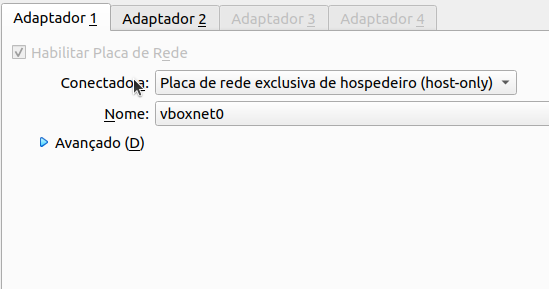
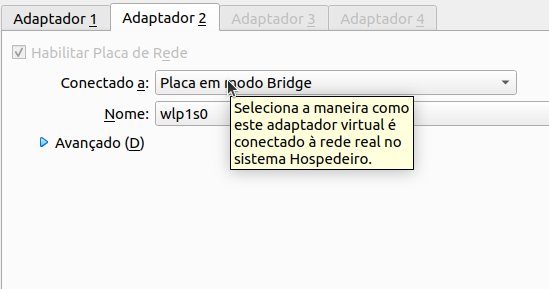

# Criando um ambiente de teste para rede, firewall e VPN, usando o VirtualBox

- 1x VM com o EndianFW: 2 interface de rede, sendo 1 (uma) em bridge e a outra como Placa exclusiva do do hospedeiro;

- 1x VM com um desktop com 1 interface de rede, sendo ela Placa exclusiva do do hospedeiro.

## Pré requisitos

- Instalar o virtualbox(é lá que você irá criar suas máquina para teste.)

- Baixar as ISO, do sistema operacional de seu preferência e a ISO do Endian Firewall

*links úteis:*

[Baixar ISO Windows7](https://tecfoco.com.br/windows-7-download-gratis-da-iso-oficial-em-portugues-br)
[Baixar ISO Endian FIrewal](https://sourceforge.net/projects/efw/)

## O que é Endian Firewall e para o que serve?

...ferramenta que “ergue uma parede invisível” para proteger os usuários dos perigos cibernéticos. O firewall atua como um filtro entre um dispositivo e sua conexão com a internet ou com a rede externa. Na prática, decide o tráfego de rede que poderá passar ou será considerado perigoso. [FONTE](https://flowti.com.br/blog/o-que-e-firewall-e-qual-e-a-sua-importancia)

## Configurações de Network no virtualbox

Abra o virtual Box > arquivos > Host Network Manager > Criar

## configurações das ISO

### Endian Firewall

Sistema operacional: Linux 2.4 (64-bit);

Tamanho da memória: 256MB;

Disco Rígido: Criar um novo disco rígido virtual agora;

Tipo de arquivo de disco rígido: VDI(VirtualBox Disk Image);

Armazenamento em disco rígido
físico: Dinamicamente alocado.B

Localização e tamanho de arquivo: 28G

### Windows7

Sistema operacional: Linux 2.4 (64-bit);

Tamanho da memória: 1024MB;

Disco Rígido: Criar um novo disco rígido virtual agora;

Tipo de arquivo de disco rígido: VDI(VirtualBox Disk Image);

Armazenamento em disco rígido físico: Dinamicamente alocado.

Localização e tamanho do arquivo: 20GB

## Configurar os adaptadores de redes

### Windows7

Selecione a máquina *WINDOWS7* > configurações > Rede > Adaptador 1

### Endian Firewall

Selecione a máquina *ENDIAN FIREWALL* > configurações > rede > Adaptador 1 (DEPOIS DE CONCLUIR A CONFIGURAÇÃO DO ADAPTADOR 1) > Adaptador 2

## Configurar o Endian Firewall via Interface Web

Ligue as máquinas que acabamos de criar (Windows7 e EndianFirewall)

- 1º passo:
  - acesse as *configurações de placa de rede* do Windows7;
- 2º passo:
  - Vá em *Alterar as configurações do adaptador*;
- 3º passo:
  - Clique com o botão direito em *Conexão local* e aperte em *Propriedades*;
- 4º passo:

**Obs:** O Endereço IP é o mesmo do seu Endian Firewall.
*link para acessar: https://seuIP:10443/*

## links úteis

[Docs Endire Firewall](http://docs.endian.com/5.2/utm/first.html)
